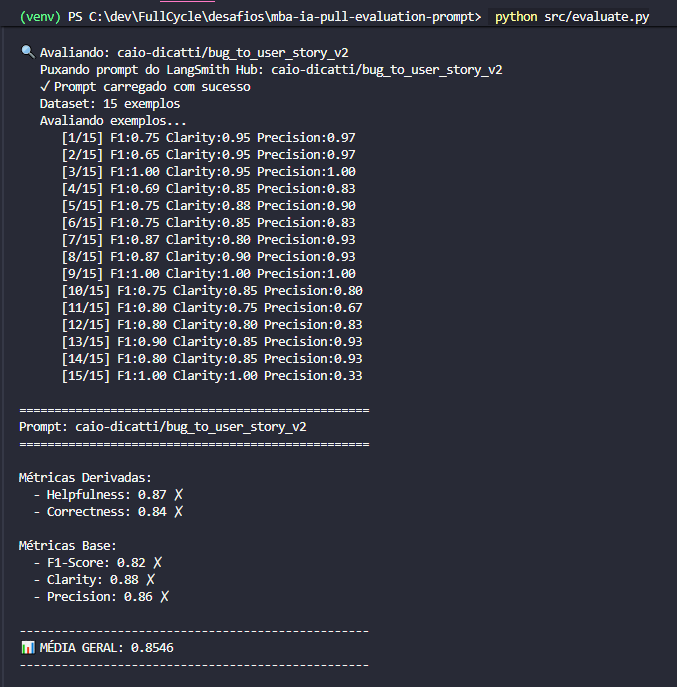
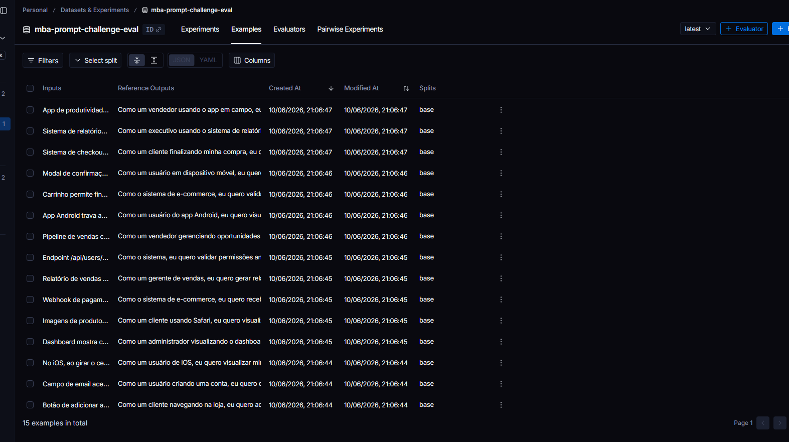
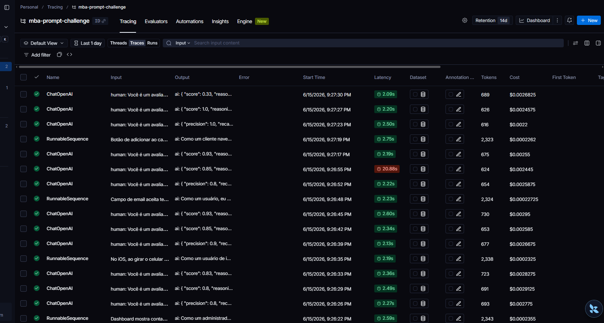
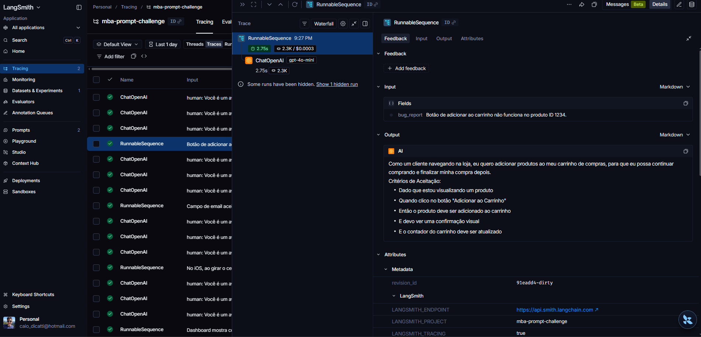

# Pull, Otimização e Avaliação de Prompts — LangChain + LangSmith

Desafio de Prompt Engineering: fazer **pull** de um prompt de baixa qualidade do LangSmith Hub (`bug_to_user_story_v1`), **otimizá-lo** com técnicas avançadas, fazer **push** da versão melhorada (`v2`) e **avaliá-la** com métricas via LLM-as-judge, atingindo o mínimo de **0.8** em todas.

O prompt converte **relatos de bug → User Story** (formato ágil, com critérios de aceitação).

**Stack:** Python 3.9+ · LangChain · LangSmith · Gemini (`gemini-2.5-flash`) · YAML

---

## A) Técnicas Aplicadas (Fase 2)

Combinei **três técnicas** no `prompts/bug_to_user_story_v2.yml`:

| Técnica | Por que escolhi | Como apliquei |
|---|---|---|
| **Role Prompting** | Condiciona vocabulário e foco em valor de negócio, no tom de uma User Story profissional. | Persona: *"Você é um Product Manager Sênior com 10 anos de experiência em metodologias ágeis."* |
| **Few-shot Learning** *(obrigatória)* | Ancora o **formato exato** de saída; como o avaliador compara com uma referência limpa, qualquer desvio derruba F1/Precision. | 3 exemplos completos (bug → User Story), um por nível: simples, médio e complexo. |
| **Chain of Thought (CoT)** | A decisão central é **classificar a complexidade** do bug para escolher o formato. O CoT guia essa análise. | Raciocínio **interno** (*"analise sem escrever"*) — se o modelo imprime o raciocínio, o avaliador penaliza. |

**Regras de saída / edge cases** que evitam penalização: usar o formato exato da complexidade; sem texto antes/depois da User Story; sem markdown extra fora dos templates; inferir o usuário pelo contexto quando não especificado.

---

## B) Resultados Finais

Avaliação executada via `evaluate.py` sobre os **15 exemplos** do dataset, com **geração `gpt-4o-mini`** e **avaliação (LLM-as-judge) `gpt-4o`** — conforme a opção OpenAI do enunciado. **Todas as 5 métricas do v2 ficaram ≥ 0.8** (alvo do desafio).

**Tabela comparativa v1 (ruim) × v2 (otimizado):**

| Métrica | v1 (baseline) | v2 (otimizado) | Mínimo |
|---|---|---|---|
| Helpfulness | ~0.45 | **0.87** ✅ | 0.8 |
| Correctness | ~0.52 | **0.84** ✅ | 0.8 |
| F1-Score | ~0.48 | **0.82** ✅ | 0.8 |
| Clarity | ~0.50 | **0.88** ✅ | 0.8 |
| Precision | ~0.46 | **0.86** ✅ | 0.8 |
| **Média** | ~0.48 | **0.85** | — |

*Derivadas: `Helpfulness = (Clarity + Precision)/2` · `Correctness = (F1 + Precision)/2`.*
*v1 = valores indicativos do prompt original não-otimizado (vago, sem persona/exemplos/formato). v2 = medição real do `evaluate.py`.*

### Evidências no LangSmith

🔗 **Prompt v2 (público):** https://smith.langchain.com/hub/caio-dicatti/bug_to_user_story_v2

**1. Métricas da avaliação — todas ≥ 0.8 (saída do `evaluate.py`):**



**2. Dataset de avaliação com os 15 exemplos:**



**3. Tracing das execuções no LangSmith:**



**4. Trace detalhado de um exemplo (bug → prompt → resposta gerada):**



---

## C) Como Executar

**Pré-requisitos:** Python 3.9+ · conta no LangSmith (API key + handle no Hub) · API key de LLM (Gemini free tier ou OpenAI).

**1. Ambiente e dependências:**
```bash
python3 -m venv venv
source venv/bin/activate          # Windows: venv\Scripts\activate
pip install -r requirements.txt
```

**2. Variáveis de ambiente** (`cp .env.example .env`):
```env
LANGSMITH_API_KEY=...
LANGSMITH_PROJECT=mba-prompt-challenge
USERNAME_LANGSMITH_HUB=...         # seu handle no LangSmith Hub
LLM_PROVIDER=google
LLM_MODEL=gemini-2.5-flash
EVAL_MODEL=gemini-2.5-flash
GOOGLE_API_KEY=...                 # ou OPENAI_API_KEY se LLM_PROVIDER=openai
```

**3. Comandos por fase:**
```bash
python src/pull_prompts.py        # pull do v1 do LangSmith Hub
python src/push_prompts.py        # push do v2 otimizado
python src/evaluate.py            # avaliação (5 métricas)
pytest tests/test_prompts.py -v   # 6 testes de validação do prompt
```

> 💡 Windows: se der `UnicodeEncodeError`, rode `$env:PYTHONUTF8="1"` (PowerShell) antes dos comandos.
